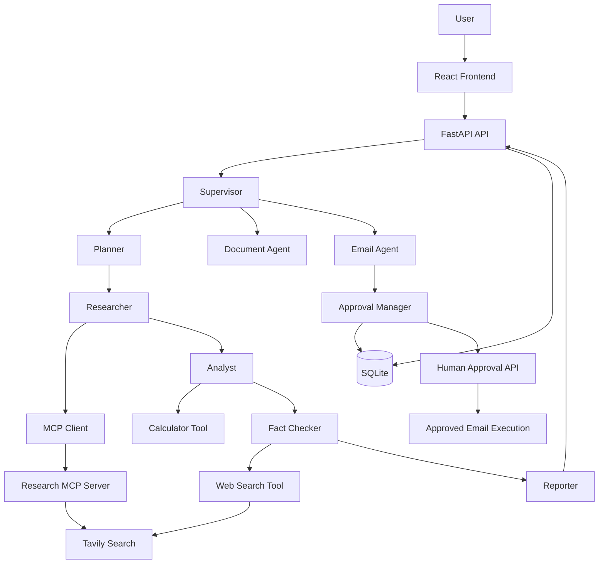

# Advanced AI Agent System

> A full-stack agentic AI application built with **FastAPI, LangGraph, LangChain, Groq, Tavily, MCP, SQLite, React, and Tailwind CSS**.
>
> The system combines planning, multi-agent research, tool calling, document handling, persistent checkpoints, and human approval for sensitive email actions.

## 📌 Overview

**Advanced AI Agent System** is a modular AI-agent application designed to solve multi-step tasks rather than simply return a single LLM response.

The backend receives a user request and initializes a shared `AgentState`. A LangGraph workflow then routes the request through specialized agents.

The main workflow supports three top-level routes:

1. **Planner** — decomposes complex requests into executable steps.
2. **Document** — handles document-oriented requests.
3. **Email** — prepares email drafts and pauses for human approval before a sensitive send action.

For research tasks, the planner pipeline is:

```text
User Request
     │
     ▼
  Supervisor
     │
     ├──────────────► Document ─────► MCP Document Server ─────► Finish
     │
     ├──────────────► Email ─────────► Approval ───► Send/Reject
     │
     ▼
  Planner
     │
     ▼
 Researcher ───► MCP Research Server ───► Tavily
     │
     ▼
  Analyst ─────► Calculator Tool
     │
     ▼
 Fact Checker ─► Web Search Tool
     │
     ▼
  Reporter
     │
     ▼
  Finish
```

---

# 🚀 Key Features

* **Multi-agent architecture** with Supervisor, Planner, Researcher, Analyst, Fact Checker, Reporter, Document, and Email agents.
* **LangGraph orchestration** using an explicit `StateGraph`.
* **LLM-based planning** that produces structured 3–6 step plans.
* **Web research through MCP** using a dedicated Research MCP server backed by Tavily.
* **Direct web-search tool** used by the fact-checking agent.
* **Calculator tool** for safe arithmetic evaluation.
* **Human-in-the-loop approval** for sensitive email actions.
* **SQLite persistence** for workflow checkpoints and approval records.
* **Role/action permission model** with sensitive-action classification.
* **Session-aware workflow state** containing research, analysis, fact-checking, reports, email, approval, and error information.
* **Structured API responses** using Pydantic models.
* **FastAPI CORS support** for the React frontend.
* **React + Vite frontend** with Markdown/GFM rendering.
* **Environment-based configuration** using `pydantic-settings` and `.env`.

---

# 🏗️ Architecture

## High-Level Architecture



---

# 🔄 LangGraph Workflow

The project uses LangGraph to orchestrate the multi-agent workflow.

The graph contains nodes for:

* `supervisor`
* `planner`
* `researcher`
* `analyst`
* `fact_checker`
* `reporter`
* `document`
* `send_email`
* `finish`
* `error`

The Supervisor determines the initial route.

### General Research Flow

```text
Supervisor
     ↓
Planner
     ↓
Researcher
     ↓
Analyst
     ↓
Fact Checker
     ↓
Reporter
     ↓
Finish
```

### Email Flow

```text
Supervisor
     ↓
Email Agent
     ↓
Create Approval
     ↓
Human Decision
   ↙       ↘
Reject    Approve
  ↓          ↓
Stop     Send Email
```

---

# 🤖 Agent Responsibilities

| Agent              | Responsibility                                                                                                  |
| ------------------ | --------------------------------------------------------------------------------------------------------------- |
| **Supervisor**     | Detects document, email, or general planning requests and selects the top-level route.                          |
| **Planner**        | Converts a complex request into a structured 3–6 step execution plan.                                           |
| **Researcher**     | Retrieves web research through the Research MCP server.                                                         |
| **Analyst**        | Extracts findings, comparisons, trends, contradictions, numbers, and missing evidence.                          |
| **Fact Checker**   | Verifies important claims and classifies evidence as verified, partially verified, unverified, or contradicted. |
| **Reporter**       | Produces a professional research report from research, analysis, fact checking, and sources.                    |
| **Document Agent** | Handles document-oriented requests.                                                                             |
| **Email Agent**    | Extracts recipient, creates an email subject/body, validates the payload, and creates a human approval request. |

---

# 🔌 MCP Integration

The Research Agent communicates with a separate MCP server.

The architecture is:

```text
Researcher Agent
       │
       ▼
MCPResearchClient
       │
       ▼
MCP stdio connection
       │
       ▼
research_server.py
       │
       ▼
Tavily API
       │
       ▼
Search Results
```

The Research Agent does not directly call Tavily.

Instead, it creates:

```python
client = MCPResearchClient()

mcp_results = await client.search(query)
```

The MCP client:

1. Starts the MCP server as a subprocess.
2. Establishes an MCP stdio connection.
3. Initializes `ClientSession`.
4. Discovers available MCP tools.
5. Validates the `search_research` tool.
6. Calls the tool.
7. Extracts the returned text.
8. Sends the results back to the Research Agent.

---

# 🔎 Research MCP Server

The MCP server is located at:

```text
Backend/app/mcp/servers/research_server.py
```

It uses:

* FastMCP
* Tavily
* stdio transport

The server exposes:

```text
search_research
```

The tool accepts:

```python
query: str
```

and returns formatted research results.

Example:

```text
RESULT 1
TITLE: Example Article
URL: https://example.com
CONTENT:
Article content...
```

The Research Agent then extracts the source information:

```python
{
    "title": "Example Article",
    "url": "https://example.com"
}
```

### Important MCP Design

Because MCP stdio uses stdout for JSON-RPC communication, the server sends logs to `stderr`.

```python
logging.basicConfig(
    stream=sys.stderr
)
```

This prevents application logs from corrupting MCP communication.

---

# 🛠️ Tools

## Tavily Web Search

The project has two web-search paths:

### 1. MCP Research Server

Used by the Researcher Agent.

```text
Researcher
    ↓
MCP Client
    ↓
Research MCP
    ↓
Tavily
```

### 2. Direct Web Search Tool

Used by the Fact Checker Agent.

The fact checker uses external search results to verify important claims.

---

# 🧮 Calculator Tool

The project contains a restricted calculator implementation.

Instead of directly executing arbitrary Python code, expressions are parsed using Python's AST functionality.

Supported operations include:

* Addition
* Subtraction
* Multiplication
* Division
* Exponentiation
* Modulo
* Unary negative

This reduces the risk associated with unrestricted `eval()` execution.

---

# 👤 Human-in-the-Loop Approval

Sending an email is considered a **sensitive action**.

The system therefore does not allow the Email Agent to directly send an email.

Instead:

```text
User Request
     ↓
Supervisor
     ↓
Email Agent
     ↓
Extract Recipient
     ↓
Generate Subject
     ↓
Generate Body
     ↓
Validate Email
     ↓
Create Approval
     ↓
SQLite
     ↓
Human Decision
```

The user can then:

### Approve

```text
Approve
   ↓
Email execution
   ↓
Email sent
```

### Reject

```text
Reject
   ↓
Workflow stops
   ↓
Email is NOT sent
```

---

# 🔐 Sensitive Actions

The permission system identifies actions that require additional protection.

Examples include:

```text
send_email
publish_report
delete_document
```

Normal actions include:

```text
web_search
calculator
read_document
create_report
```

The application therefore separates normal AI operations from actions that can cause external side effects.

---

# 💾 Checkpoint & Persistence System

The application uses SQLite for persistence.

The custom:

```text
CheckpointDB
```

stores workflow state and approval information.

### Checkpoints

The checkpoint table stores:

```text
session_id
state
```

The workflow state is serialized before being stored.

### Approvals

The approval table stores:

```text
session_id
approval
```

This allows the application to recover information associated with a pending approval.

Default database:

```text
agent_state.db
```

---

# 🧠 Agent State

The workflow uses a shared state containing information such as:

```text
user_id
session_id
query

status
next_agent

plan
current_step

research
analysis
fact_check
report

sources

messages
memories
previous_queries

errors
retry_count

file_path

email_payload
email_subject
email_body
email_sent

tool_result

approval_required
approval_status
approval_action
approval_reason
approval
```

This shared state allows each agent to perform its own responsibility without tightly coupling the agents together.

---

# 🔑 Authentication & Permissions

The approval API uses request headers:

```text
X-User-Id
X-User-Role
```

The current approval workflow verifies that the session belongs to the requesting user.

Example:

```text
X-User-Id: demo-user
X-User-Role: user
```

The permission layer separates regular and sensitive operations.

> **Production recommendation:** Replace the current header-based identity mechanism with a proper JWT/OAuth authentication system before deploying this application publicly.

---

# 🌐 FastAPI API

The FastAPI application uses:

```text
/api/v1
```

as the API prefix.

---

## Root Endpoint

```http
GET /
```

Example response:

```json
{
  "name": "Advanced AI Agent",
  "status": "running",
  "docs": "/docs"
}
```

---

# ❤️ Health Endpoint

```http
GET /api/v1/health
```

Example:

```json
{
  "status": "healthy"
}
```

---

# 💬 Chat Endpoint

```http
POST /api/v1/chat
```

Example request:

```json
{
  "user_id": "demo-user",
  "session_id": "session-123",
  "message": "Research the latest developments in generative AI."
}
```

The endpoint:

1. Validates the message.
2. Creates the initial `AgentState`.
3. Starts the LangGraph workflow.
4. Waits for the workflow result.
5. Extracts the report/tool/email result.
6. Returns a structured `ChatResponse`.

Example response:

```json
{
  "session_id": "session-123",
  "status": "completed",
  "answer": "# Research Report\n...",
  "plan": [],
  "sources": [],
  "approval_required": false,
  "approval": null,
  "errors": []
}
```

---

# ✋ Approval Endpoint

```http
POST /api/v1/approval
```

Example:

```json
{
  "session_id": "session-123",
  "decision": "accept"
}
```

Supported decisions:

```text
accept
approve
reject
rejected
```

The API:

1. Validates the decision.
2. Loads the session.
3. Verifies the user owns the session.
4. Retrieves the pending approval.
5. Checks that it is still pending.
6. Saves the decision.
7. Executes the email only when approved.

---

# ⚙️ Configuration

The application uses environment variables.

Create:

```text
Backend/.env
```

Example:

```env
GROQ_API_KEY=
TAVILY_API_KEY=

MODEL_NAME=llama-3.3-70b-versatile

APP_NAME=Advanced AI Agent

DATABASE_PATH=agent_state.db

REPORTS_DIR=../data/reports
DOCUMENTS_DIR=../data/documents

CORS_ORIGINS=http://localhost:5173
```


# 🧰 Technology Stack

## Backend

| Technology        | Purpose                          |
| ----------------- | -------------------------------- |
| Python            | Core programming language        |
| FastAPI           | REST API                         |
| Uvicorn           | ASGI server                      |
| Pydantic          | Data validation                  |
| Pydantic Settings | Configuration                    |
| LangChain         | LLM and tool framework           |
| LangGraph         | Agent workflow orchestration     |
| Groq              | LLM inference                    |
| LangChain-Groq    | Groq integration                 |
| Tavily            | Web search                       |
| MCP               | External tool/server integration |
| SQLite            | Persistent state                 |
| python-dotenv     | Environment variables            |

## Frontend

| Technology     | Purpose                 |
| -------------- | ----------------------- |
| React          | User interface          |
| Vite           | Frontend build tool     |
| Tailwind CSS   | Styling                 |
| Axios          | API communication       |
| React Markdown | Markdown rendering      |
| remark-gfm     | GitHub Markdown support |
| Oxlint         | Linting                 |

---

# 📁 Project Structure

```text
Advanced-AI-Agent-system/
│
├── Backend/
│   │
│   ├── app/
│   │   │
│   │   ├── API/
│   │   │   ├── health_routes.py
│   │   │   ├── chat_routes.py
│   │   │   └── approval_routes.py
│   │   │
│   │   ├── agents/
│   │   │   ├── supervisor.py
│   │   │   ├── planner.py
│   │   │   ├── researcher.py
│   │   │   ├── analyst.py
│   │   │   ├── fact_checker.py
│   │   │   ├── report.py
│   │   │   ├── document_agent.py
│   │   │   ├── email_agent.py
│   │   │   └── llm.py
│   │   │
│   │   ├── approval/
│   │   │   ├── policy.py
│   │   │   └── approval_maneger.py
│   │   │
│   │   ├── checkpoints/
│   │   │   └── database.py
│   │   │
│   │   ├── mcp/
│   │   │   ├── client.py
│   │   │   │
│   │   │   └── servers/
│   │   │       ├── research_server.py
│   │   │       └── document_server.py
│   │   │
│   │   ├── memory/
│   │   │   ├── long_term.py
│   │   │   ├── short_term.py
│   │   │   └── vector.py
│   │   │
│   │   ├── schemas/
│   │   │   ├── approval.py
│   │   │   ├── chat.py
│   │   │   └── plan.py
│   │   │
│   │   ├── security/
│   │   │   ├── auth.py
│   │   │   └── permission.py
│   │   │
│   │   ├── tools/
│   │   │   ├── search.py
│   │   │   ├── document.py
│   │   │   ├── emails.py
│   │   │   └── calculator.py
│   │   │
│   │   ├── workflows/
│   │   │   ├── state.py
│   │   │   ├── node.py
│   │   │   ├── email_workflow.py
│   │   │   └── research_graph.py
│   │   │
│   │   ├── configuration.py
│   │   ├── logging_configuration.py
│   │   └── main.py
│   │
│   ├── requirements.txt
│   ├── .env
│   ├── .gitignore
│   ├── venv
│   └── agent_state.db
│
├── Frontend/
│   │
│   ├── src/
│   │   ├── Components/
│   │   │   ├── Chatboat.jsx
│   │   │   ├── ChatInput.jsx
│   │   │   └── Message.jsx
│   │   ├── assets/
│   │   ├── App.jsx
│   │   ├── App.css
│   │   ├── index.css
│   │   └── main.jsx
│   │
│   ├── package.json
│   ├── vite.config.js
│   ├── gitignore
│   ├── .env
│   └── vercel.json
│
└── README.md
```

---

# 🛠️ Installation

## 1. Clone Repository

```bash
git clone https://github.com/Sachin6389/Advanced-AI-Agent-system.git

cd Advanced-AI-Agent-system
```

---

# 🐍 Backend Setup

Go to the Backend directory:

```bash
cd Backend
```

Create a virtual environment:

```bash
python -m venv venv
```

Install dependencies:

```bash
pip install -r requirements.txt
```

Create:

```text
Backend/.env
```

and add your API keys.

---

# ▶️ Start Backend

Run:

```bash
uvicorn app.main:app --reload
```

Backend:

```text
http://localhost:8000
```

Swagger API documentation:

```text
http://localhost:8000/docs
```

ReDoc:

```text
http://localhost:8000/redoc
```

---

# ⚛️ Frontend Setup

Open another terminal:

```bash
cd Frontend
```

Install dependencies:

```bash
npm install
```

Run development server:

```bash
npm run dev
```

Frontend:

```text
http://localhost:5173
```

---

# 🔌 Running MCP

The Research MCP server normally does **not** need to be started manually.

The application automatically starts:

```text
Backend/app/mcp/servers/research_server.py
```

when the Research Agent invokes:

```python
MCPResearchClient.search()
```

The client starts the subprocess using:

```python
sys.executable
```

and communicates through:

```text
stdio
```

---

# 💡 Example Prompts

## Research

```text
Research the impact of generative AI on software development and create a detailed report.
```

## Technical Comparison

```text
Compare LangGraph and CrewAI for production multi-agent applications.
```

## Fact Checking

```text
Research recent advances in AI agent architectures and verify the important claims.
```

## Email

```text
Send the research report to example@example.com with a professional summary.
```

The system prepares the email and waits for human approval before sending it.

## Document

```text
Analyze the uploaded document and summarize its important findings.
```

---

# 🧯 Error Handling

The application includes error handling at multiple levels.

### API

* Empty message validation
* Pydantic validation
* HTTP exception handling

### MCP

* Server path validation
* MCP subprocess failure handling
* MCP initialization validation
* Tool registration validation
* Tool execution errors
* Empty response validation

### Research

* Empty query handling
* Tavily API errors
* Invalid search results
* Missing API keys

### Approval

* Invalid decisions
* Missing sessions
* Unauthorized session access
* Missing approvals
* Already processed approvals
* Email execution failures

### Workflow

* Agent exceptions
* Workflow failures
* Retry/error state handling
* Centralized logging

---

# 📝 Logging

The project uses centralized logging.

Important events include:

```text
Supervisor route selection
Planner execution
Research execution
MCP startup
MCP session initialization
MCP tool discovery
Tavily search
Analysis
Fact checking
Report generation
Approval creation
Approval decision
Email execution
Workflow completion
Workflow failure
```

The MCP server writes logs to:

```text
stderr
```

rather than stdout.

This is important because MCP stdio uses stdout for protocol communication.

---

# 🔒 Security Considerations

### Email

Email sending is treated as a sensitive operation and requires human approval.

### Session Ownership

Before processing an approval, the system verifies that:

```text
session.user_id == current_user.user_id
```

### Input Validation

Email recipient data and other sensitive inputs should be validated before execution.

### CORS

Development:

```text
http://localhost:5173
```

Production should use the actual frontend domain rather than allowing arbitrary origins.

---

# 🧪 Example Workflow

Suppose the user asks:

```text
Research the latest developments in AI agents
and send the report to example@example.com.
```

The system executes:

```text
1. User submits request
           ↓
2. FastAPI receives request
           ↓
3. Supervisor detects email intent
           ↓
4. Email/Research workflow is executed
           ↓
5. Planner creates research steps
           ↓
6. Researcher performs MCP research
           ↓
7. Tavily retrieves sources
           ↓
8. Analyst analyzes results
           ↓
9. Fact Checker verifies claims
           ↓
10. Reporter generates final report
           ↓
11. Email Agent prepares email
           ↓
12. Approval is created
           ↓
13. Human reviews email
           ↓
       ┌────┴────┐
       ↓         ↓
    Approve    Reject
       ↓         ↓
  Send Email   Stop
```

This demonstrates the difference between a simple chatbot and an agentic workflow.

---

# 🤖 Why This Project Is Agentic

A traditional chatbot usually works like:

```text
User
 ↓
LLM
 ↓
Response
```

This application works differently:

```text
User
 ↓
Supervisor
 ↓
Planner
 ↓
Researcher
 ↓
External MCP Tool
 ↓
Tavily
 ↓
Analyst
 ↓
Fact Checker
 ↓
Reporter
 ↓
Final Report
```

For sensitive actions:

```text
User
 ↓
Email Agent
 ↓
Validation
 ↓
Approval
 ↓
Human Decision
 ├─────────────┐
 ↓             ↓
Approve       Reject
 ↓             ↓
Execute       Stop
```

The system therefore demonstrates:

* Planning
* Multi-agent collaboration
* Tool calling
* MCP integration
* External web research
* Shared state
* Persistent checkpoints
* Error handling
* Human-in-the-loop approval
* Sensitive-action protection

---

# 📊 Example API Response

```json
{
  "session_id": "session-123",
  "status": "completed",
  "answer": "# Executive Summary\n...",
  "plan": [
    {
      "id": 1,
      "task": "Research the requested topic.",
      "agent": "researcher",
      "requires_tool": true,
      "depends_on": []
    }
  ],
  "sources": [
    {
      "title": "Example source",
      "url": "https://example.com"
    }
  ],
  "approval_required": false,
  "approval": null,
  "errors": []
}
```

---

# 📈 Development Roadmap

## Completed

* [x] FastAPI backend
* [x] React frontend
* [x] LangGraph workflow
* [x] Supervisor routing
* [x] LLM-based planning
* [x] MCP research integration
* [x] Tavily web research
* [x] Analysis Agent
* [x] Fact-checking Agent
* [x] Report generation
* [x] Calculator tool
* [x] SQLite checkpoints
* [x] Human approval workflow
* [x] Role/action permission model
* [x] CORS configuration
* [x] Structured Pydantic API schemas
* [x] MCP stdio communication
* [x] Error handling and logging

## Future Improvements

* [ ] JWT/OAuth authentication
* [ ] Streaming/SSE workflow updates
* [ ] Production database
* [ ] Background task queue
* [ ] Long-term semantic memory
* [ ] Agent evaluation framework
* [ ] Automated unit/integration tests
* [ ] Docker deployment
* [ ] CI/CD pipeline
* [ ] Observability and tracing
* [ ] Additional MCP servers
* [ ] More external tools
* [ ] Production email provider integration
* [ ] Better document processing
* [ ] Persistent cross-session memory

---

# 🌟 Project Highlights

This project demonstrates practical implementation of modern agentic AI concepts:

### Planning

Complex user requests are decomposed into smaller executable steps.

### Multi-Agent Workflow

Different agents specialize in different responsibilities instead of relying on a single LLM prompt.

### Tool Calling

Agents can use external capabilities such as web search and calculator operations.

### MCP

The research capability is separated into an MCP server, demonstrating a standardized tool/server architecture.

### Memory & Checkpoints

Workflow state can be persisted using SQLite.

### Human Approval

Potentially sensitive actions such as sending emails require explicit human approval.

### Error Handling

Failures are captured and logged across API, workflow, MCP, tool, and email layers.

---

# 🚀 Production Improvements

For production deployment, the following improvements are recommended:

1. Implement JWT/OAuth authentication.
2. Replace SQLite with PostgreSQL or another production database.
3. Add Redis for caching and distributed state where appropriate.
4. Add background workers for long-running research.
5. Add streaming responses.
6. Add OpenTelemetry/LangSmith-style tracing.
7. Add automated tests.
8. Add rate limiting.
9. Add stronger email validation.
10. Store secrets using cloud secret managers.
11. Containerize the application using Docker.
12. Add CI/CD with automated testing.
13. Add persistent long-term memory.
14. Add agent evaluation and regression testing.

---

# 📂 Repository

GitHub:

```text
https://github.com/Sachin6389/Advanced-AI-Agent-system
```

---

# 👨‍💻 Author

**Sachin Gond**

**AI/ML Engineer | Generative AI | Python | Machine Learning**

---

# 📜 License

Add the license appropriate for your project before distributing the repository publicly.
